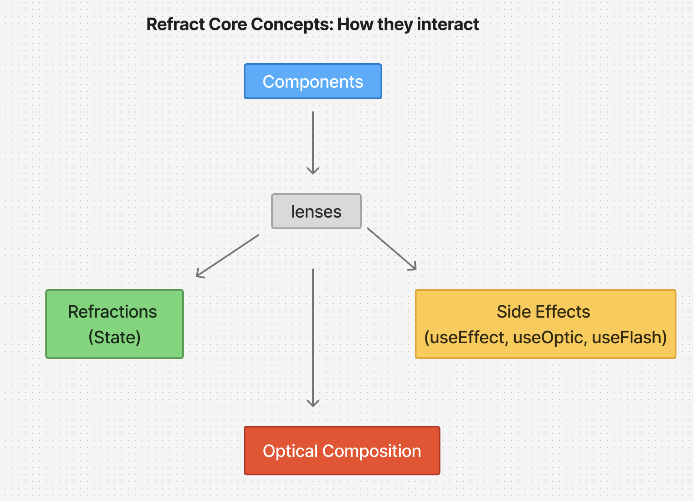

# Refract core concepts connection

Here’s a diagram showing how Refract’s core concepts connect:

- **Components** sit at the top.
- **Lenses** act as the bridge between everything.
- **Refractions** (state), **Side Effects**, and **Optical Composition** all flow into Lenses.

Together, they power your UI logic and updates.